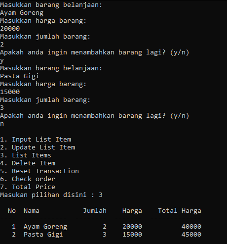
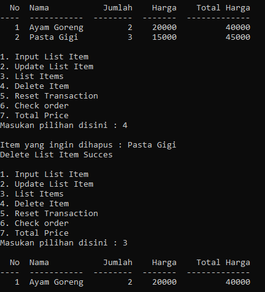
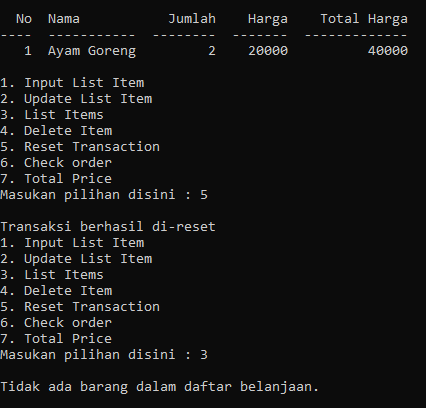
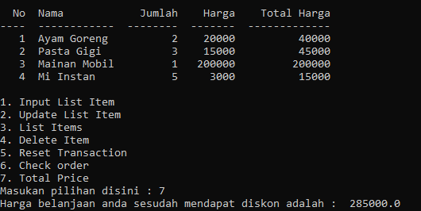

# Latar Belakang
Andi memiliki rencana untuk melakukan perbaikan proses bisnis, yaitu Andi akan membuat sistem kasir yang self-servie di supermarket miliknya. Sehingga customer bisa langsung memasukkan item yang dibeli, jumlah item yang dibeli, dan harga item yang dibeli dan fitur yang lain. Hal ini agar customer yang tidak berada di kota tersebut dapat tetap berbelanja di supermarket milik Andi.

# Objectives
begini journey Customer dalam membantu orang yang berbelanja tersebut:
1.	Customer memasukan barang ingin dibeli beserta harga dan jumlah.
2.	Jika ternyata ada kesalahan dalam memasukkan nama item atau jumlah item atau harga item tetapi tidak ingin menghapus itemnya, Customer bisa melakukan update.
3.	Jika batal membeli item belanjaan, Customer bisa melakukan:
  a.  Menghapus salah satu item dari nama item.
  b.  Langsung menghapus semua transaksi atau reset transaksi dengan method.
4.  Setelah transaksi dilakukan customer dapat memeriksa apakah barang yang dibeli sudah sesuai dengan yang diinginkan atau belum. 
5.  Setelah melakukan pengecekan, Customer bisa menghitung total belanja yang sudah dibeli dan ada diskon khusus dengan ketentuan :
a.	Jika total belanja Andi diatas Rp 200.000 maka akan mendapatkan diskon 5%
b.	Jika total belanja Andi diatas Rp 300.000 maka akan mendapatkan diskon 8%
c.	Jika total belanja Andi diatas Rp 500.000 maka akan mendapatkan diskon 10%

# Test Case

